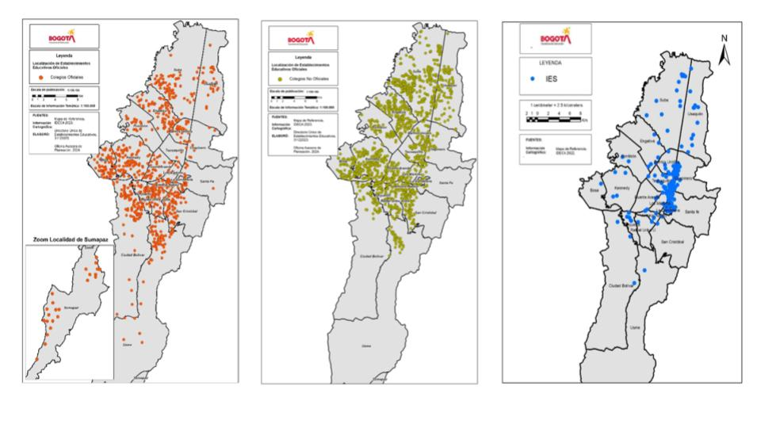
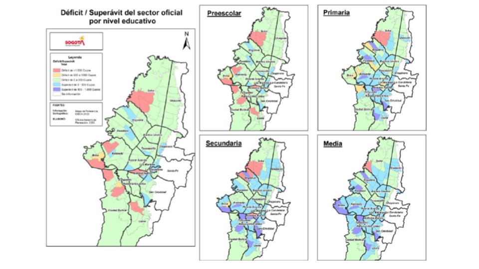

<h1 align="center">
    <a href= "https://uniandes-my.sharepoint.com/:w:/r/personal/s_gutierrez11234_uniandes_edu_co/_layouts/15/doc2.aspx?sourcedoc=%7B83327737-2cfe-4bf7-85ee-9fb37aeb7ac3%7D&action=edit&wdPid=6281dde4">
    
    </a>
</h1>


# Titulo
´Missing´

## Problema

La asignación de colegios en Bogotá es un proceso engorroso que requiere el cáclulo de diferentes puntajes y en ocasiones puede perjudicar a algunos estudiantes. En este proyecto trataremos de agrupar estudiantes en clusters similares y compararemos los ranking de colegios a los que quedan asignados y otras métricas.

## Metodología (propuesta)

Una de las limitaciones de los algoritmos de clustring es que para modelar variables categoricas es necesario utilizar distancias dificiles de interpretar o que bien no logran capturan las nociones de densidad (DBSCAN) adecuadamente. Por ello, decidimos para este proyecto utilizar un acercamiento que nos permita combinar las variables categoricas en un texto que después tokenizamos por medio del uso de un LLM. Una vez hecho eso, aplicamos una técnica de reducción (PCA, SVD) y finalmente ejecutamos el algoritmo con datos númericos únicamente.

En este proyecto compararemos el desempeño de lo sisguientes algoritmos.
1. Kmeans. 
2. DBSCAN.
3. KMedodis.
4. LLM Parcial (sobre variables categóricas únicamente) + PCA + KMeans/ KMedoids/DSCAN.
5. LLM Total + PCA + KMeans/KMedoids/DSCAN.


## Detalles del problema de negocio

Bogotá tiene un sistema educativo robusto. Uno de cada tres habitantes de la ciudad está vinculado al sistema educativo de la ciudad, que reúne casi 2,5 millones de personas de los cuales 1,4 millones son niños, niñas y adolescentes en los niveles preescolar, básica, secundaria y media (académica y técnica). Cerca de 743.000 de ellos son atendidos por el sector oficial y 425.000, por el sector privado. Las localidades con mayor matrícula son Suba, Kennedy y Bosa. La oferta del sector oficial está concentrada en las localidades de Bosa, Kennedy y Ciudad Bolívar, donde se atiende cerca del 25 % de estudiantes de la ciudad (Secretaría Distrital de Educación, 2024). 

Adicionalmente, considerando que Bogotá cuenta con una alta población infantil que representa el 23,6 % de los habitantes, con una marcada desigualdad socioeconómica, se hace evidente la necesidad depd.intervenciones específicas bajo un enfoque territorial, diferencial,pd.interseccional y de género. Sectores con índices significativos de pobreza y extrema pobreza, junto con la diversidad cultural y étnica, requieren enfoques diferenciados y pertinentes para abordar las particularidades de cada comunidad. 

En cuanto a instituciones, Bogotá cuenta con 1.962 colegios, 1.881 jardines, 134 instituciones de educación superior (IES) y 445 de educación para el trabajo y el desarrollo humano (IETDH). De los colegios, el sector oficial cuenta con 406 instituciones (371 de administración directa y 35 de administración contratada), el sector privado cuenta con 1.551 y existen 5 colegios oficiales con régimen especial. En la Ilustración 1   se encuentran georreferenciados los colegios del sector oficial, no oficial y las IES.   

Ilustración 1 – Colegios oficiales, No Oficiales & IES. 



Fuente:'SED con base en el DUE & IDECA. 

Al realizar un análisis de oferta y demanda para el sector oficial (en los niveles de preescolar a media), se encuentra que persiste un déficit de cupos en algunas zonas de la ciudad; especialmente UPZ de las localidades de Suba, Kennedy, Bosa, Antonio Nariño. Ciudad Bolívar y Usme. Este déficit de cupos es significativo para el nivel de preescolar en las UPZ El Rincón, Tibabuyes y Patio Bonito.   

Ilustración 2- Déficit/ Superávit del Sector Oficial por Nivel Educativo. 



 

Fuente:'Estudio de Insuficiencia y Limitaciones 2023 (Secretaría de Educación del Distrito, 2022) 

La gestión de la cobertura educativa gira en torno a la modernización del proceso para la asignación eficiente de cupos educativos en Bogotá siendo una prioridad para garantizar que todas y todos los estudiantes tengan acceso a una educación de calidad. Mejorar y optimizar el proceso de asignación de cupos y la reducción de las barreras que limitan el acceso de los niños, niñas, adolescentes y jóvenes al sistema educativo y, de esta manera, promover la igualdad y equidad de oportunidades. 

## Data

Usamos tres fuentes de datos:

- `inscripciones`: contiene información de estudiantes solicitantes de cupo para el año 2024.
- `icfes`: contiene información de puntajes en las pruebas saber en el período 2013-2023 por sede educativa.
- `capacidad`: contiene información de las capacidad de los colegios de acuerdo al último informe del 2013.


A continuación detallamos la estructura del repositorio:

```
clustering_llm
├─ data
│  ├─ inscripciones.xslx
│  ├─ icfes.xslx
│  ├─ capacidad.xslx
├─ figs
├─ embedding.ipynb (Tokenización)
├─ proyecto_final_ans_gr5.py (EDA y ML)
├─ README.md

```

## Requerimientos

Se usa Python 3.9 a lo largo del proyecto y las siguientes librerías.

-`matplotlib   == 3.9.2`
-`numpy        == 2.0.2`
-`pandas       == 2.2.2`
-`scipy        == 1.13.1`
-`seaborn      == 0.13.2`
-`session_info == 1.0.0`
-`sklearn      == 1.5.1`


